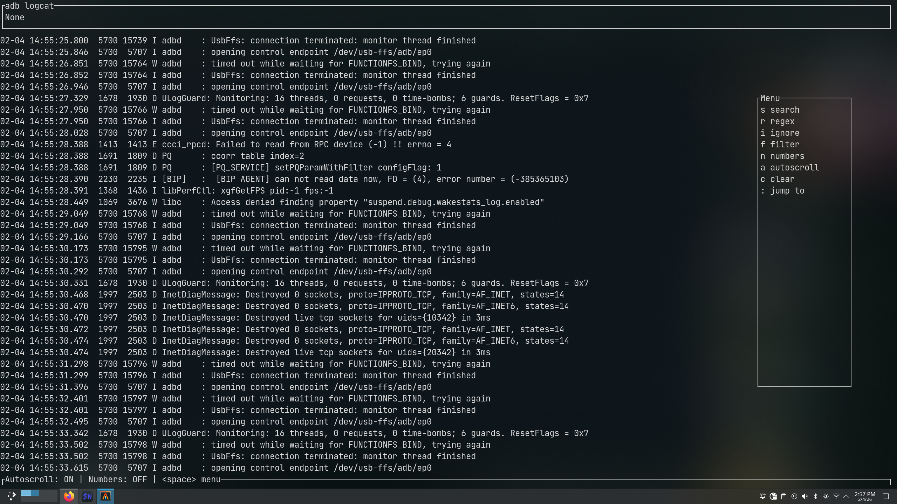
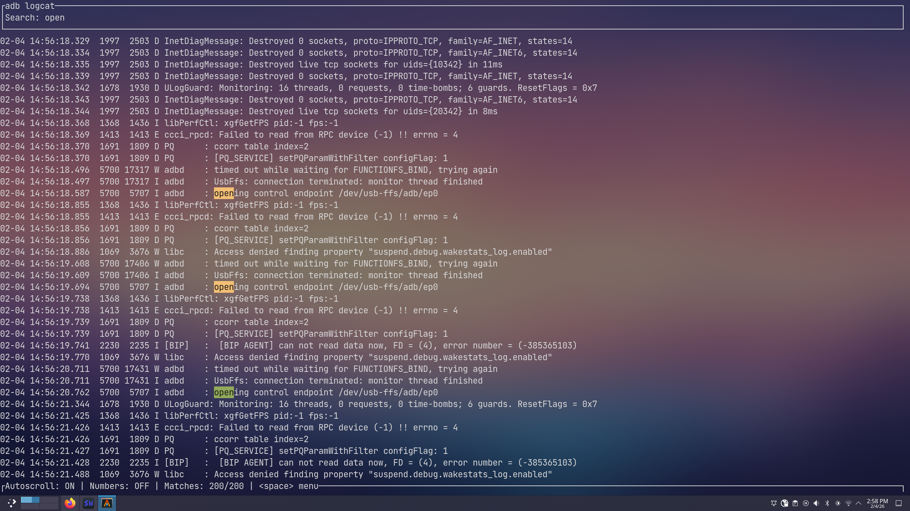
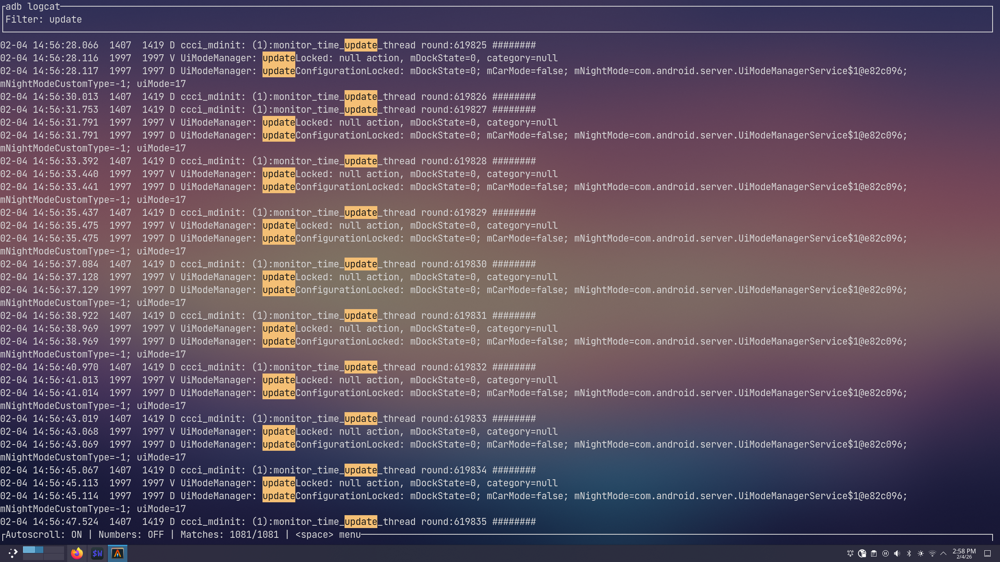

# Filter

<div align="center">


*A powerful stdout filtering tool for long running applications*

[](https://crates.io/crates/filter)
[](LICENSE)
[](https://www.rust-lang.org)

</div>

## ✨ Features

- 🎯 **Real-time filtering** - Filter stdout output as it happens
- 🖥️ **Beautiful TUI** - Terminal User Interface built with ratatui
- 🔍 **Regex support** - Powerful pattern matching capabilities
- ⚡ **High performance** - Built with Rust for maximum speed
- 🔄 **Live updates** - See filtered results in real-time

## 📸 Screenshots

### Clean Interface


### Active Filtering


### Pattern Matching


## 🚀 Quick Start

### Installation

```bash
cargo install filter
```

### Usage

Basic usage - filter any command's stdout:

```bash
filter <command> [args...]
```

#### Examples

**Flutter development:**
```bash
filter flutter run
```

** npm scripts:**
```bash
filter npm run dev
```

**Docker logs:**
```bash
filter docker logs -f container_name
```

**Python applications:**
```bash
filter python app.py
```

## 🎮 Keyboard Shortcuts

- `Ctrl+q` - Quit the application
- `space` - Opens up the menu
- `j/k` - Navigate through output
- `Ctrl+C` - Exit immediately

## 🔧 Configuration

Filter supports environment variables for customization:

```bash
# Set log file location
export FILTER_LOG_FILE=/tmp/filter.log

# Run with custom log level
RUST_LOG=debug filter your-command
```

## 🛠️ Development

### Building from source

```bash
git clone https://github.com/yourusername/filter-rs.git
cd filter-rs
cargo build --release
```

### Running tests

```bash
cargo test
```

## 📝 License

This project is licensed under the MIT License - see the [LICENSE](LICENSE) file for details.

## 🤝 Contributing

Contributions are welcome! Please feel free to submit a Pull Request.

## 📊 Performance

Built with performance in mind:
- ✅ Zero-allocation string processing
- ✅ Concurrent output handling with Rayon
- ✅ Optimized regex matching
- ✅ Memory-efficient buffer management

---

<div align="center">

Made with ❤️ in Rust

</div>
